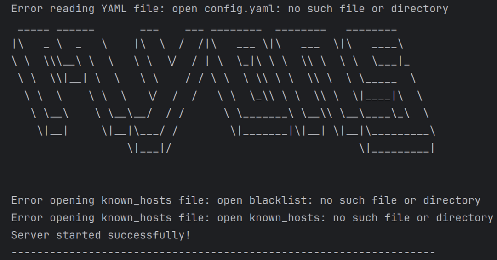

# MyDNS

MyDNS is a DNS server application written in Go. It is designed to be simple, efficient, and easy to use.

## Features

- Lightweight and fast
- Easy to configure
- Supports basic DNS functionalities

## Requirements

- Go 1.16 or later

## Installation

1. Clone the repository:
    ```sh
    git clone https://github.com/darwineee/MyDNS.git
    cd mydns
    ```

2. Build the application:
    ```sh
    make build
    ```
    The executable file will be generated in the `bin` directory.

## Usage

1. Create a configuration file named `config.yaml` in the root directory of the application. Available options are demonstrated in 
`config-example.yaml` as default values. If you want to use the default values, you can skip this step.

2. Create `blacklist` and `known_hosts` files in the root directory of the application. The `blacklist` file contains
a list of domain name only, otherwise `known_hosts` contains a map of domain name and IP address. Put each entry one per line.
The `blacklist` file can be used to block access to certain domains, while the `known_hosts` file can be used to resolve.
Both files are optional. Skip this step if you don't need them.

3. Run the application:
    ```sh
    make run
    ```

4. The application will start and listen for DNS queries.


## Development

